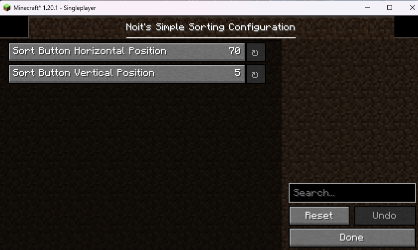

# Simple Sorting

Simple Sorting is a Minecraft mod - made with [Fabric](https://github.com/FabricMC/fabric) - which aims to add one function to Minecraft: inventory sorting.

Note: If you want to use this mod on a dedicated server, the server needs to have the the mod installed as well.

## Installation

There are two ways to install Simple Sorting: manual or semi-automatic with CurseForge.

### CurseForge
If you don't want to manually install it, you can use CurseForge: https://www.curseforge.com/minecraft/mc-mods/noits-simple-sorting

### Manual
This mod requires Fabric Loader and Fabric API. You can get them here: https://fabricmc.net/ if you haven't already.

In addition, since v0.7.0+1.20.1, it also requires [YetAnotherConfigLib-v3](https://github.com/isXander/YetAnotherConfigLib).

1. Go to the [latest release](https://github.com/Noitcereon/simple-sorting/releases).
2. Download the `noits-simple-sorting-<VERSION>.jar`
3. Put it into your mods folder 
   - The mods folder should be located in your .minecraft folder (search for %appdata% and go into the .minecraft folder from there)
         - If the mods folder doesn't exist create it. It MUST be named mods exactly. 
         - 

   - The mods folder should contain, at least, 3 files like this:
   - 
    
4. Run the game with your installed Fabric version.

## Usage

Once you've installed it, you should see a Sort button appear in chests and barrels like so:

By default, the button appear on the right side of the screen and near the top. (70% away from the left, 5% away from the top). 

Sort button location can be changed in the configuration, which is opened by pressing F4 (by default) and should look like this:

## Maintainer
[Noitcereon](https://github.com/Noitcereon)

## Contributions
Pull Requests are welcome, however please try to make [Atomic Commits](https://www.aleksandrhovhannisyan.com/blog/atomic-git-commits/) when doing so.

Be sure to take a look at the [dev documentation](./docs/dev-documentation), especially the [design-decisions](./docs/dev-documentation/design-decisions.md), where the [public api](https://github.com/Noitcereon/simple-sorting/blob/main/docs/dev-documentation/design-decisions.md#versioning) is also defined.

## License
[MIT](https://github.com/Noitcereon/simple-sorting/blob/1.19/LICENSE) © Thomas "Noit" A.
